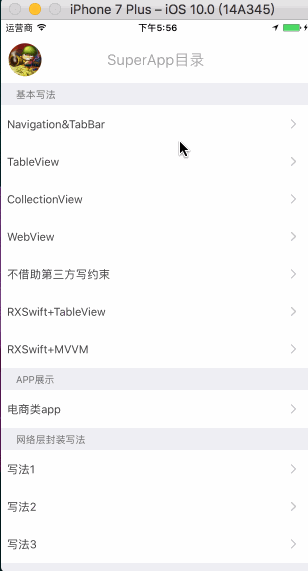

#[SP_MJRefresh](https://github.com/Friends-Home/SuperApp/blob/master/SuperApp/Tool/SP_MJRefresh/SP_MJRefresh.swift)
##MJRefresh二次封装,请跳转到项目 [SuperApp] (https://github.com/Friends-Home/SuperApp) 中查看
####基于swift3.0，提供MJRefresh二次封装思路，使MJRefresh使用更方便。

